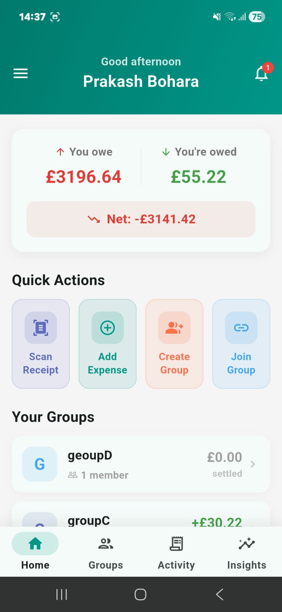
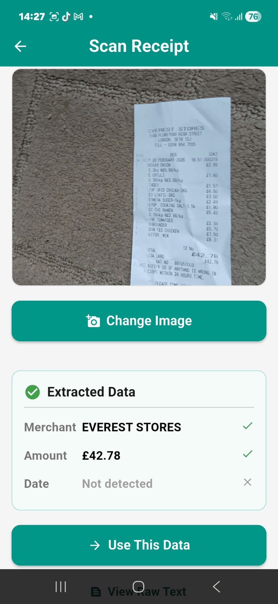
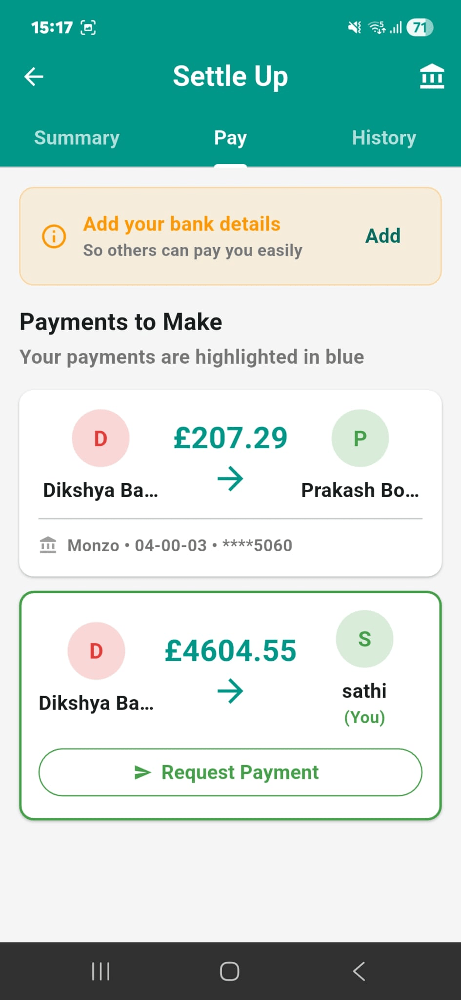
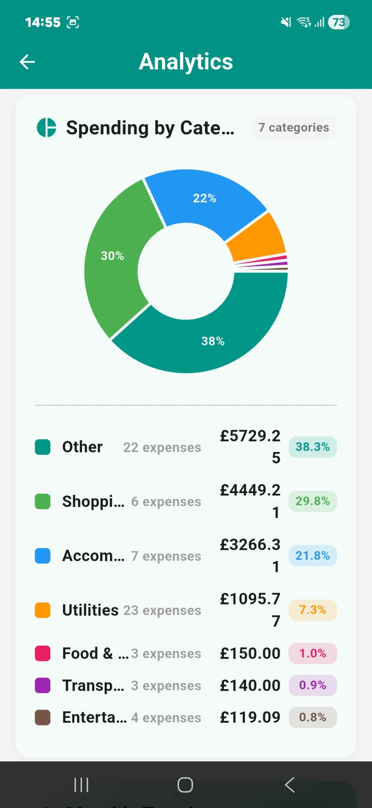

# SmartSplit

> **Intelligent bill-splitting and expense-sharing for Android**
> Final-year project · BSc (Hons) Computer Science · University of Roehampton

[](https://flutter.dev)
[](https://firebase.google.com)
[](https://developers.google.com/ml-kit)
[](https://www.android.com/)
[](#licence)

---

## Overview

**SmartSplit** is a mobile application that simplifies shared expense management for students, flatmates, and travel groups. It addresses three persistent weaknesses of existing applications: tedious manual entry, settlements requiring more transactions than necessary, and useful features locked behind paywalls.

The application combines on-device receipt recognition, real-time multi-device synchronisation, and a provably optimal settlement algorithm in a single, freely available Android app.

---

## Key Features

| Feature | Description |
|---|---|
| 📷 **On-device OCR** | Receipt scanning through Google ML Kit; processes images locally with no network dependency |
| 🧮 **Optimal Settlement** | Minimum-Cost Maximum-Flow (MCMF) algorithm minimises the number of transactions to settle group debts |
| ⚡ **Real-time Sync** | Cloud Firestore listeners propagate changes to all group members within seconds |
| 🔐 **Layered Security** | Salted SHA-256 OTP authentication, atomic-transaction rate limiting, AES-256-CBC encrypted bank details, biometric app-lock |
| 📊 **Analytics Dashboard** | Per-category, per-member, and monthly spending breakdowns powered by `fl_chart` |
| 🌐 **Offline Capable** | Firestore offline persistence allows reads and reconciles writes on reconnect |

---

## Screenshots


| Home | Scan Receipt | Settlement | Analytics |
|---|---|---|---|
|  |  |  |  |

---

## Architecture

SmartSplit follows a three-tier architecture:

The settlement algorithm executes client-side; OCR runs entirely on-device via ML Kit.

---

## Technology Stack

**Mobile:** Flutter 3.38.4 · Dart 3.10.3
**Backend:** Firebase Authentication · Cloud Firestore · Cloud Functions v2 · Cloud Messaging · App Distribution · Crashlytics
**Machine Learning:** Google ML Kit (on-device text recognition)
**State Management:** Provider (ChangeNotifier-based)
**Charting:** fl_chart
**Local Storage:** flutter_secure_storage · shared_preferences
**Authentication:** Biometric via `local_auth`

---

## Getting Started

### Prerequisites

- Flutter SDK 3.38.4 or later
- Dart 3.10.3 or later
- Android Studio with Android SDK 33+
- Node.js 20+ (for Cloud Functions deployment)
- A Firebase project with Authentication, Firestore, Cloud Functions, FCM, and App Distribution enabled

### Installation

```bash
# Clone the repository
git clone https://github.com/boharap1/SmartSplit.git
cd SmartSplit

# Install Flutter dependencies
flutter pub get

# Configure Firebase (replace with your own project's config)
# - Place google-services.json in android/app/
# - Update lib/firebase_options.dart through flutterfire configure

# Run on an attached device or emulator
flutter run
```

### Cloud Functions deployment

```bash
cd functions
npm install
firebase deploy --only functions
```

---

## Testing

The settlement algorithm is covered by 9 unit tests:

```bash
flutter test test/settlement_algorithm_test.dart
```

Test cases cover two-user simple debt, multi-user optimisation, balance settlement, near-zero filtering, decimal rounding, multi-creditor scenarios, single-user edge cases, and unbalanced-input detection.

Functional, security, and pilot user-acceptance testing are documented in Chapter 7 of the project report.

---

## Project Structure

---

## Algorithmic Highlight: MCMF Settlement

The settlement problem is modelled as a Minimum-Cost Maximum-Flow network where each debtor-to-creditor edge carries unit cost. The minimum-cost flow corresponds to the minimum-transaction settlement, with optimality guaranteed by the max-flow min-cut theorem.

For a four-member group with two creditors and two debtors, MCMF reduces a naive 4-transaction settlement to **2 transactions** — the theoretical minimum.

Implementation: [`lib/services/settlement_algorithm.dart`](lib/services/settlement_algorithm.dart)

Algorithm details: Section 5.6.2 of the project report.

---

## Project Report

The full final-year report documenting the design, implementation, and evaluation of SmartSplit is available [here](docs/SmartSplit_Final_Report.pdf) *(link to be added once submitted)*.

### Report contents
- **Chapter 1:** Introduction and aims
- **Chapter 2:** Background and competitor analysis
- **Chapter 3:** Tools, methods, and project planning
- **Chapter 4:** Requirements and personas
- **Chapter 5:** Solution design (architecture, schema, algorithms)
- **Chapter 6:** Implementation across six development sprints
- **Chapter 7:** Testing and evaluation (n=7 pilot UAT)
- **Chapter 8:** Discussion
- **Chapter 9:** Conclusion and future work

---

## Evaluation Highlights

From the pilot user-acceptance study (n=7):

- **7.71/10** mean overall rating
- **71.4%** of respondents would use SmartSplit in real life
- **71.4%** endorsed the clarity of the user interface
- **3 out of 7** respondents rated the application 10/10

Five v1.0.1 fixes were shipped mid-evaluation in direct response to user feedback, demonstrating the iterative methodology in practice.

---

## Future Work

- System Usability Scale (SUS) evaluation with 25–30 respondents
- Percentage and exact split UI modes (FR7 completion)
- iOS deployment and cross-platform validation
- Improved OCR robustness through fine-tuned learned models
- Automated UI and integration test coverage
- Larger-scale performance and concurrency testing

---

## Author

**Prakash Bohara**
BSc (Hons) Computer Science, University of Roehampton
Project supervisor: Kimia Aksir

🔗 [GitHub Profile](https://github.com/boharap1)

---

## Acknowledgements

This project was developed under the supervision of **Kimia Aksir** at the University of Roehampton, whose guidance throughout the academic year shaped both the technical direction and the analytical depth of the work. Thanks also to the seven pilot UAT participants whose feedback drove the v1.0.1 release.

---

## Licence

This project is submitted as part of academic coursework at the University of Roehampton. The source code is made publicly available for review and educational reference. Third-party libraries are used under their respective open-source licences with attribution.

---

<sub>*Built with Flutter · Backed by Firebase · Powered by Google ML Kit*</sub>

